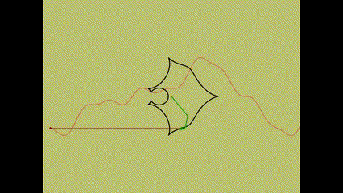
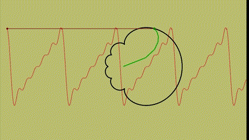
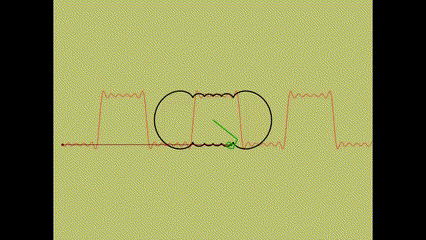
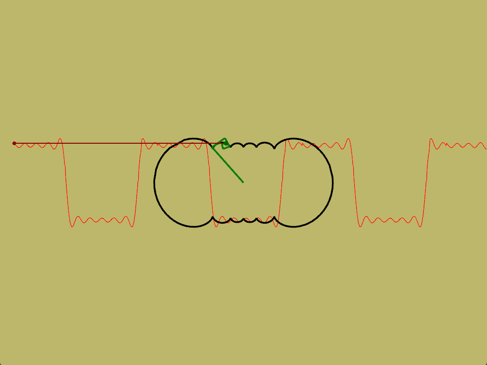
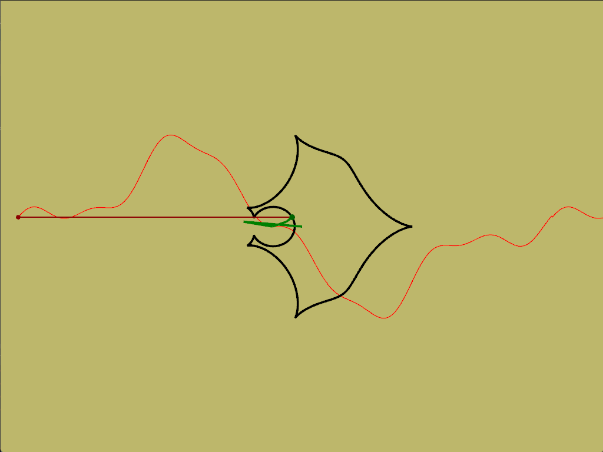
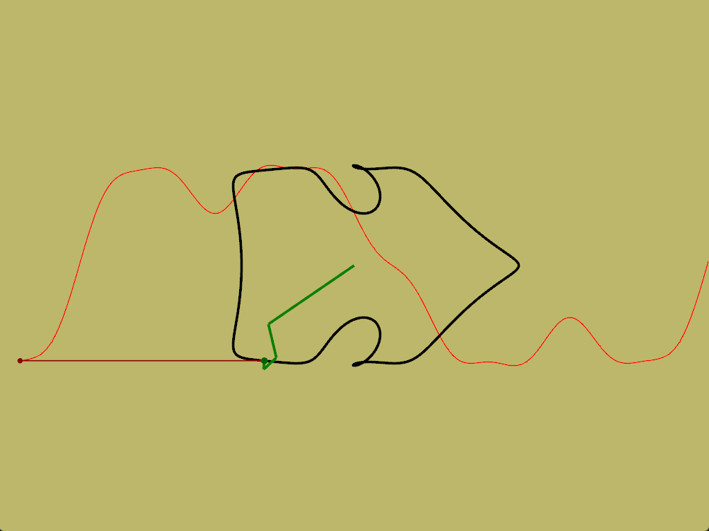
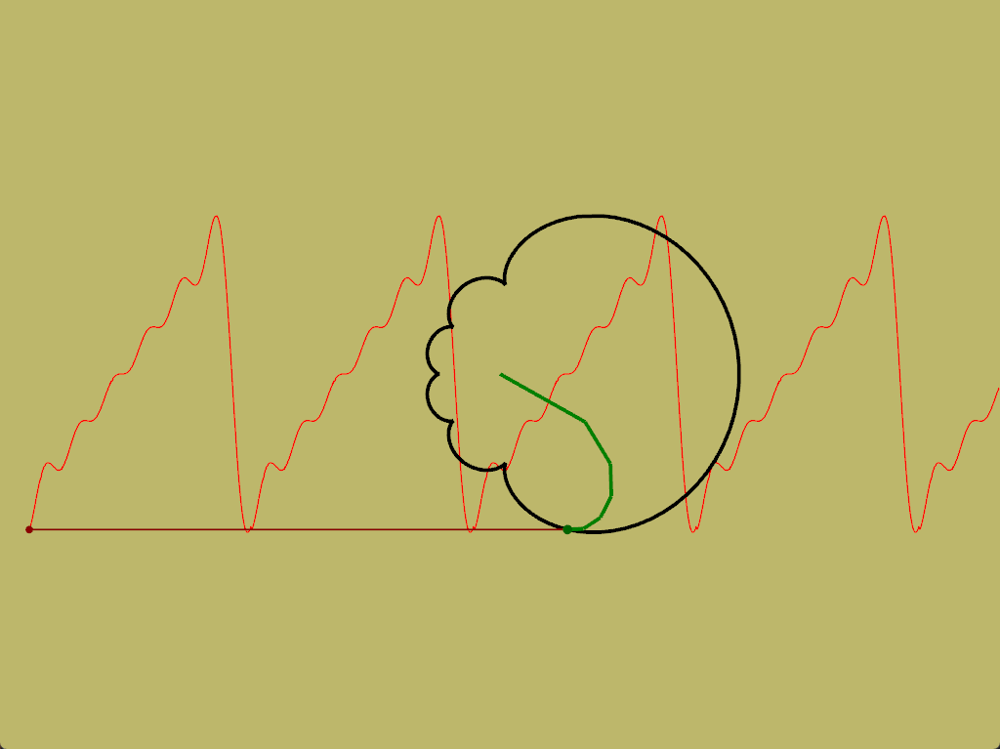

# Fourier Series Visualization
Implementação simples da [visualização](#demo) da série de Fourier em [Rust](https://www.rust-lang.org/) utilizando o framework gráfico [nannou](https://nannou.cc/). <br> 
Com uma [série de Fourier](https://en.wikipedia.org/wiki/Fourier_series) é possível aproximar qualquer tipo de onda apenas realizando a soma de ondas senoidais com diferentes amplitudes e comprimentos.

# Usage
Para utilizar, primeiramente [compile](#build--run) o programa. <br>
A geração dos pontos é feita através de círculos que rotacionam a uma velocidade especificada. <br>
O equivalente a uma onda seno é representada por um valor de *size* e *speed*, onde o *size* é o tamanho da crista da onda, de fato o tamanho do raio do círculo e o *speed* é o período da onda. Um valor de *speed* igual a 1.0 significa uma rotação completa do círculo em 2 * PI segundos (~6.28s) e valores maiores indicam uma rotação mais rápida e valores entre 0.0 e 1.0 indicam uma rotação mais lenta. Já valores negativos indicam uma rotação no sentido oposto, por padão valores positivos giram no sentido anti-horário e valores negativos no sentido horário. <br>
Quando o padrão começa a repetir-se, não são adicionados mais pontos à figura, rotações muito rápidas podem levar a figuras com pouca definição, pois poucos pontos serão gerados, enquanto que rotações muito lentas podem gerar pontos em excesso e **possivelmente** levar o programa a quebrar.<br>
Existe uma pasta `src/example` com algumas configurações que geram alguns padrões, você pode utilizá-los como entrada para o programa, passando o caminho do arquivo `.txt` como parâmetro do binário executável.

# Build & Run
**Para você compilar, tenha o toolchain Rust instalado. Para instalar veja [aqui](https://www.rust-lang.org/tools/install).<br>**
- Clone o repositório <br>
```shell
git clone https://github.com/JelsonRodrigues/fourier_series_visualization
```
- Entre no diretório criado <br>
```shell
cd fourier_series_visualization
```
- Compile
```shell
cargo build --release
```

Após a realização destes passos, um binário executável será gerado na pasta `/target/release` <br>
Você pode rodar o binário utilizando um arquivo `.txt` com as configurações das ondas que serão utilizadas, existem alguns disponíveis na pasta `/src/example/` <br>

Exemplo <br>
```shell
./target/release/fourier_series_visualization.exe ./src/example/square_wave.txt
```

# Demo

## GIF





## ScreenShots



